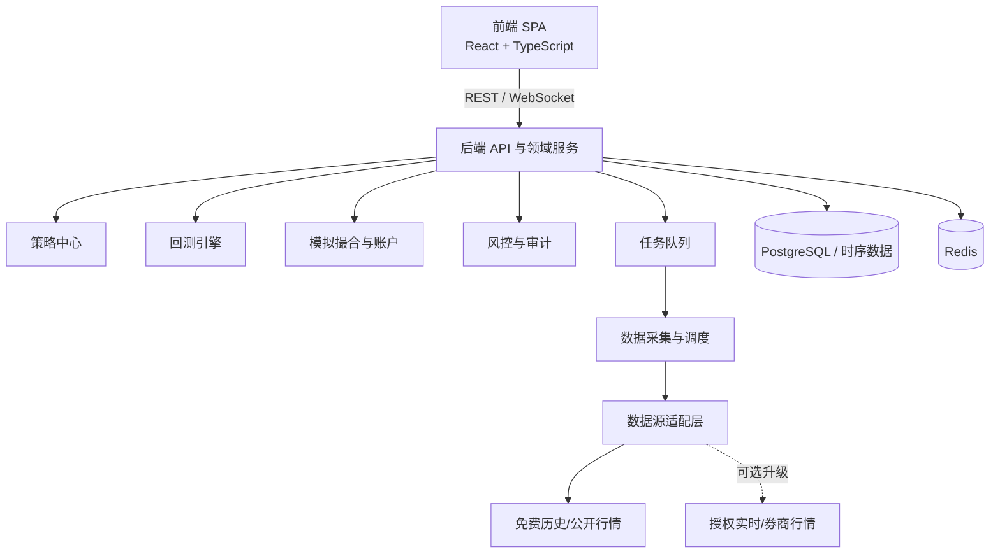

# A 股模拟量化交易系统：需求分析与拆解

> 版本：v0.1（需求评审稿）  
> 日期：2026-07-26  
> 目标：将初始诉求转化为可评审、可实施的产品与技术需求，并明确免费数据的边界。

## 1. 执行摘要

建议先建设一个“日频 / 分钟级、准实时、可复盘”的 A 股模拟量化交易系统：

- 使用免费公开或社区数据支持历史研究和回测；
- 通过可插拔行情适配器接入盘中行情；
- 通过模拟撮合引擎复刻 A 股关键交易规则；
- 采用前后端分离，后端统一提供 REST API 与 WebSocket 推送；
- 首期不接入真实资金和券商自动下单。

**关键边界：**免费数据可支持历史回测、收盘后更新与部分盘中准实时展示；但不应承诺“稳定、低延迟、可商用的实时 Level-2 行情”。该能力通常需要交易所或授权商业数据服务。系统须从一开始将数据源抽象为可替换适配器，避免绑定任何非正式接口。

## 2. 原始诉求拆解与可验收定义

| 原始诉求 | 系统化解释 | 建议验收口径 |
|---|---|---|
| 模拟真实 A 股行情交易 | 模拟行情驱动、交易规则、成交和账户变化，而非仅按收盘价买卖。 | 能按交易日历、T+1、涨跌停、停牌、最小交易单位、费用与滑点完成回测和仿真。 |
| 数据源免费 | 核心研究数据不依赖付费订阅；允许后续可选升级。 | 历史日线、证券主数据、复权/公司行为可由免费源获取并落库；实时数据明确延迟与不保证性。 |
| 主流量化能力 | 覆盖从数据、研究、回测、模拟交易到风险与复盘的闭环。 | 具备策略生命周期、绩效归因、订单/成交/持仓账本、参数化回测、告警与审计。 |
| 前后端分离 | 界面与计算、存储、撮合解耦。 | 前端独立部署；后端 API 文档化；行情和任务状态可经 WebSocket 或 SSE 推送。 |

## 3. 产品范围

### 3.1 首期（MVP）应包含

- A 股股票、指数与交易日历的主数据管理；日线行情为必选，分钟行情作为可选开关。
- 策略研究：因子/技术指标计算、股票池过滤、信号生成和版本管理。
- 事件驱动回测：按指定区间、初始资金、调仓周期、费用、滑点和基准运行。
- 模拟交易：下单、撤单、订单状态、成交、持仓、现金、盈亏和每日结算。
- 基础风控：单票仓位、总仓位、行业暴露、最大回撤、涨跌停/停牌拒单和资金校验。
- 前端工作台：行情/自选、策略配置、回测报告、模拟账户、订单成交、风险告警。

### 3.2 暂不纳入 MVP

- 真实券商下单、实盘资金托管与自动实盘交易。
- 稳定低延迟 Level-2、逐笔成交和盘口级高频回测。
- 期权、融资融券、期货、可转债等多资产复杂规则。
- 深度学习训练平台、研报/舆情 NLP、跨市场套利。

## 4. 数据方案与现实边界

| 层级 | 候选免费来源 | 建议用途 | 限制与处理原则 |
|---|---|---|---|
| 基础历史数据 | Tushare Pro（免费权限）、AkShare、Baostock 等 | 股票列表、交易日历、日线、财务/公告辅助字段、指数行情 | 以落库快照为准；记录来源、拉取时间、字段版本和复权口径。 |
| 交易所公开资料 | 上交所、深交所、巨潮资讯等公开页面/文件 | 公告校验、停复牌、公司行为、市场统计和规则依据 | 遵守站点条款和访问频率；不依赖页面抓取作为唯一生产数据链路。 |
| 盘中免费行情 | 合法公开可访问的聚合行情或券商展示接口（通过适配器） | 模拟盘展示、非高频策略的准实时触发 | 延迟、完整性、稳定性与再分发权利均不保证；必须显示数据来源和延迟。 |
| 可选商业升级 | 券商量化平台、交易所授权行情、Choice/Wind/iFinD 等 | 稳定实时、分钟/逐笔、生产级服务 | 作为后续配置，不改变领域模型与 API。 |

数据治理最低要求：证券代码统一、交易日对齐、复权口径可追溯、公告可得时间（防未来函数）、停复牌与 ST 状态、退市股票保留、缺失值监控、原始数据不可覆盖。

## 5. 真实感模拟：A 股规则清单

| 规则 | MVP 处理方式 | 说明 |
|---|---|---|
| 交易时段与交易日 | 按交易日历驱动事件；区分集合竞价、连续竞价、收盘后结算。 | 首期可先以分钟 bar 或日线 bar 模拟，撮合精度必须随数据粒度标注。 |
| T+1 | 股票当日买入不可卖出；历史持仓可卖。 | 持仓需记录可用数量与冻结数量。 |
| 涨跌停 | 生成可交易价格边界；触及涨停买入/跌停卖出按成交规则处理。 | 不同板块、上市初期和 ST 等情况应配置化。 |
| 停复牌与退市 | 停牌拒单；复牌后根据行情恢复；退市保留历史与强制清算规则。 | 避免幸存者偏差。 |
| 交易单位 | 买入按最小交易单位及其整数倍；卖出支持清仓零股。 | 参数化以适配不同证券类型。 |
| 费用与税费 | 佣金、印花税、过户费、最低佣金配置化。 | 回测与模拟盘使用相同费用引擎。 |
| 成交与滑点 | 按 bar 成交模型、成交量参与率和滑点模型模拟。 | 必须明确模拟成交不等同于真实可成交。 |

## 6. 功能模块与优先级

| 模块 | 核心能力 | 优先级 |
|---|---|---|
| 数据中心 | 采集、清洗、校验、落库、回补、数据血缘、数据质量告警 | P0 |
| 策略中心 | 策略模板、参数、股票池、指标、信号、版本和运行记录 | P0 |
| 回测引擎 | 事件驱动、费用/滑点、基准比较、批量参数实验、结果可复现 | P0 |
| 模拟交易 | 模拟订单、撮合、成交、持仓、资金、日终结算与账户快照 | P0 |
| 风险管理 | 下单前校验、仓位限额、回撤阈值、黑名单与告警 | P0 |
| 分析与复盘 | 净值、收益/回撤、夏普、胜率、换手、归因、订单时间线 | P1 |
| 任务调度 | 数据更新、信号计算、策略运行、日终结算、失败重试 | P1 |
| 多用户与权限 | 用户、角色、账户隔离、API Token、审计日志 | P1 |
| 实盘连接器 | 券商接口、风控审批、订单路由 | P2，需另行合规评审 |

## 7. 前后端分离架构建议

推荐采用“前端 SPA + 后端领域服务 + 异步任务 + 数据存储”的模块化单体起步架构。它比一开始拆微服务更容易交付，但通过清晰接口保留后续拆分空间。



| 层 | 职责 | 建议技术选择（可评审） |
|---|---|---|
| 前端 | 工作台、图表、策略配置、账户与订单页面、实时状态展示 | React + TypeScript + Vite；ECharts 或 Lightweight Charts。 |
| API / 业务服务 | 认证、策略、回测、账户、订单、风控、报告、审计 | Python FastAPI（适合量化生态）或 Java Spring Boot；REST API + OpenAPI。 |
| 实时通道 | 行情/订单/任务状态推送 | WebSocket；低频状态也可使用 SSE。 |
| 任务与计算 | 数据同步、回测运行、定时调度、日终任务 | Celery/RQ + Redis 或同类队列；长任务不得阻塞 API。 |
| 存储 | 事务账本、行情时序、缓存、文件化报告 | PostgreSQL；可选 TimescaleDB；Redis；对象存储/本地文件。 |
| 数据适配层 | 统一不同数据源字段、节流、缓存、可用性降级 | Provider Adapter 接口；每条数据带来源、延迟、时间戳和质量状态。 |

核心边界：前端只调用后端 API，不直接抓取行情；策略运行和撮合只在后端执行；所有下单、成交、资金变化均写入不可变审计记录。

## 8. 核心领域模型与接口

| 实体 | 关键字段 | 关系 |
|---|---|---|
| `Instrument` | `symbol`、`exchange`、`list_date`、`delist_date`、`board`、`status` | 被行情、订单、持仓和公司行为引用。 |
| `MarketBar` / `Quote` | `timestamp`、OHLC、`volume`、`source`、`delay_ms` | 支持日线/分钟线；不可与未来时间数据混用。 |
| `Strategy` / `StrategyRun` | `version`、`parameters`、`universe`、`schedule`、`status` | 一次运行生成信号、订单意图和可复现配置。 |
| `BacktestRun` | `period`、`initial_cash`、`cost_model`、`fill_model`、`metrics` | 绑定数据快照与策略版本。 |
| `SimAccount` / `Position` | `cash`、`available_cash`、`quantity`、`available_quantity`、`cost` | 形成 T+1 与冻结资金/证券的基础。 |
| `Order` / `Fill` | `side`、`price`、`qty`、`status`、`submitted_at`、`filled_at` | 订单状态机驱动撮合与账本变化。 |
| `RiskRule` / `Alert` | `scope`、`threshold`、`action`、`triggered_at` | 支持拒单、限仓、暂停策略及可解释告警。 |

API 示例：

```text
GET  /api/v1/market/bars
POST /api/v1/backtests
GET  /api/v1/backtests/{id}
POST /api/v1/sim/orders
GET  /api/v1/accounts/{id}/positions
WS   /ws/streams/{accountId}
```

所有写操作应具备幂等键与审计 ID。

## 9. 非功能需求与质量门槛

- **可复现性：**每次回测保存策略版本、参数、数据快照版本、费用/滑点模型与运行环境。
- **正确性：**关键交易规则与费用计算应有单元测试；用固定案例测试 T+1、涨跌停、停牌和除权除息。
- **性能：**日频全市场回测优先保证稳定和可复现；分钟级回测作为独立性能目标，不与日频 MVP 绑定。
- **可观测性：**数据拉取成功率、延迟、缺失率、任务耗时、回测失败原因、订单拒绝原因均可查看。
- **安全：**密码哈希、Token 过期、权限分层、敏感配置不入库、审计日志防篡改；模拟盘与未来实盘严格隔离。
- **合规与许可：**记录每个数据源的使用条款、字段来源和再分发限制；免费并不自动代表可用于商业分发。

## 10. 分阶段交付建议

| 阶段 | 目标 | 主要交付物 | 完成标准 |
|---|---|---|---|
| Phase 0：技术验证 | 证明免费数据链路与核心规则可行 | 数据适配器 PoC、股票/日线落库、交易规则单测 | 可稳定导入一段历史数据，规则测试通过。 |
| Phase 1：研究与回测 MVP | 建立策略到绩效的闭环 | 策略模板、日频回测、费用滑点、绩效报告、前端回测页 | 可复现至少两类策略，并输出完整回测记录。 |
| Phase 2：模拟盘 | 引入准实时行情与账户交易体验 | 订单状态机、撮合、持仓/资金、风控、WebSocket 页面 | 连续运行多个交易日，账本可对账、异常可追溯。 |
| Phase 3：增强 | 提升研究深度与运营能力 | 分钟级、批量实验、归因、告警、多用户、容器化部署 | 性能、稳定性和权限满足预定指标。 |

## 11. 风险、假设与待确认项

### 11.1 主要风险

- 免费盘中行情可能中断、延迟或变更接口，导致模拟盘与真实市场不同步。
- 仅使用收盘价或未来已知成分股会高估策略效果；须防止未来函数和幸存者偏差。
- 不建模成交量、涨跌停排队和滑点会显著高估流动性较差股票策略的可执行性。
- 将模拟绩效视为实盘预期会产生误导；前端必须持续展示数据延迟与模拟假设。

### 11.2 需要本次评审确认

1. 首个版本是否只覆盖沪深 A 股普通股票，暂不含北交所、ETF、可转债和融资融券？
2. 模拟盘目标是“收盘后复盘 + 次日信号”，还是“交易时段准实时虚拟下单”？
3. 日频 MVP 是否足够，分钟级行情/回测是否列为 Phase 3？
4. 系统是单用户本地/自部署，还是需要多用户 SaaS 形态？
5. 技术栈是否确定为 React + FastAPI + PostgreSQL + Redis？
6. 是否允许后续接入付费或券商数据源，但保持免费数据为默认模式？

## 12. 建议的评审结论

建议批准以“**日频回测 + 准实时模拟盘 + 可插拔免费数据源 + 前后端分离**”为 MVP 定位。

该定位能在不购买数据的前提下覆盖主流量化系统最重要的研究、回测、仿真、风控与复盘闭环，同时不对免费实时数据的可靠性作不切实际的承诺。待 MVP 验证后，再根据策略频率与实际需求决定是否采购实时/Level-2 数据或接入券商平台。
