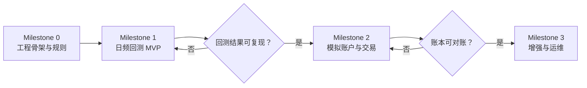
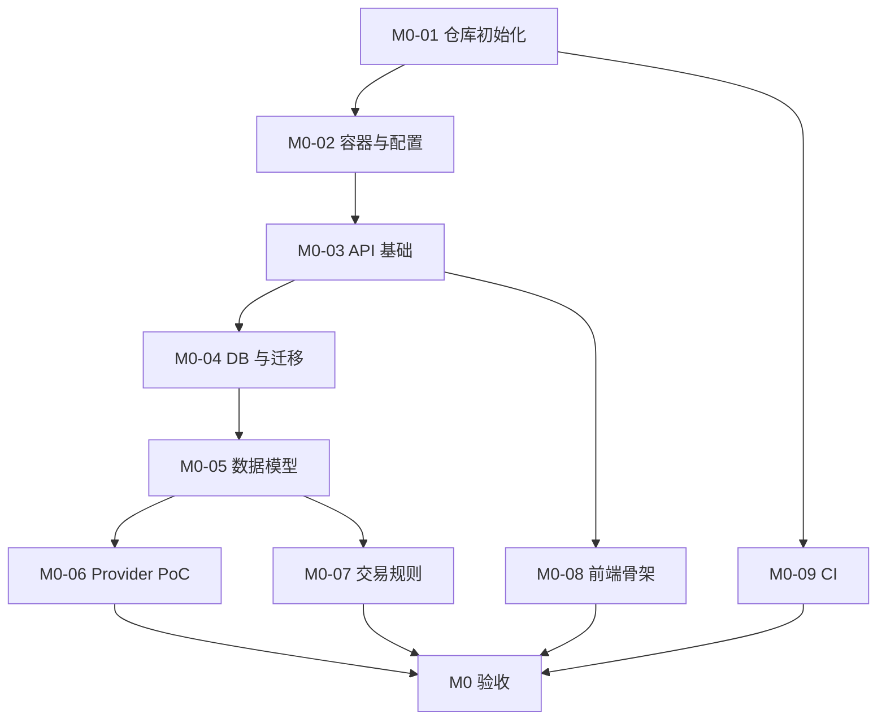

# A Share Quant Trading System: Implementation Plan

## 当前实施状态（2026-07-26）

- M0：核心工程骨架、A 股基础交易规则、日线/交易日历导入、Fixture 与 Tushare 适配器已完成；公司行为和完整 Raw/Canonical 分层仍待完成。
- M1：单证券日频回测、数据快照、双均线与买入持有策略、回测任务创建/查询/取消、前端轮询状态、基础报告和前端回测工作流已完成；实时进度推送和更丰富策略仍待完成。
- M2：模拟账户、幂等订单、冻结、限价撮合、部分成交、成交记录、资金流水、持仓批次、撤单、交易日门控日终结算、账户净值快照、基础风控和模拟盘前端已完成；公司行为与组合级风险仍待完成。
- M3：本地 SQLite 运行模式、运行状态接口、审计事件、Celery Beat 日终调度和运行手册已完成；分钟线、多用户、告警、备份恢复和实时推送仍待完成。

> 状态：待确认后执行
> 版本：v0.1
> 日期：2026-07-26
> 关联：[需求文档](../a-share-quant-trading-requirements-v0.1.md)｜[方案设计](system-design-v0.1.md)｜[开发规则](../AGENTS.md)

## 1. 实施目标

以最小可验证路径交付一个可本地运行的 A 股日频量化研究、回测与模拟交易系统。实施遵循“先规则正确、再策略闭环、后模拟盘体验”的顺序：

## 2. 本计划采用的默认假设

若下列假设与预期不一致，应在开始 Milestone 0 前调整：

| 项目 | 默认选择 | 原因 |
|---|---|---|
| 项目名称 | `a-share-quant-lab` | 用作 GitHub 仓库名与应用标识。 |
| 标的范围 | 沪深 A 股普通股票 | 控制初期规则复杂度。 |
| 行情频率 | 日线优先 | 免费数据可得性和回测可复现性更好。 |
| 日频成交 | T 日收盘生成信号，T+1 开盘尝试成交 | 避免收盘价未来函数。 |
| 技术栈 | React + TypeScript；FastAPI + Python；PostgreSQL；Redis；Celery | 与方案设计一致，适合量化场景。 |
| 部署方式 | 单用户、本地 Docker Compose | 先缩小身份认证和多租户的范围。 |
| 数据模式 | 免费 Provider + 可插拔适配层 | 降低初始成本，保留后续升级空间。 |
| 策略模式 | 内置策略模板 / 声明式配置 | 避免首期开放任意代码执行的安全问题。 |

## 3. 里程碑总览

| 里程碑 | 目标 | 主要产出 | 进入条件 | 完成门槛 |
|---|---|---|---|---|
| M0 | 工程骨架与交易规则验证 | 前后端骨架、容器化、本地依赖、核心规则与数据 PoC | 默认假设确认 | 固定数据集可导入；规则单测通过。 |
| M1 | 日频回测 MVP | 策略模板、数据快照、事件驱动回测、报告页面 | M0 完成 | 两类策略可复现运行并输出报告。 |
| M2 | 模拟账户与模拟交易 | 订单、撮合、资金/持仓账本、风控、模拟盘 UI | M1 完成 | 多交易日运行后账本可对账。 |
| M3 | 增强与运维 | 分钟线、任务监控、告警、多用户、可选实时数据 | M2 完成 | 性能/稳定性满足预定目标。 |

## 4. Milestone 0：工程骨架与规则验证

### 4.1 工作包

| 编号 | 工作包 | 交付内容 | 依赖 |
|---|---|---|---|
| M0-01 | 仓库初始化 | `frontend/`、`backend/`、`docs/adr/`、统一 `.gitignore`、README、开发环境说明。 | 无 |
| M0-02 | 本地运行环境 | Docker Compose：PostgreSQL、Redis、后端 API、Worker；`.env.example`。 | M0-01 |
| M0-03 | 后端基础能力 | FastAPI 应用、健康检查、配置加载、结构化日志、统一异常、OpenAPI。 | M0-02 |
| M0-04 | 数据库与迁移 | ORM/迁移框架、基础 schema、测试数据库配置。 | M0-03 |
| M0-05 | 证券与行情模型 | `Instrument`、交易日历、`MarketBar`、Raw/Canonical 数据分层。 | M0-04 |
| M0-06 | 数据 Provider PoC | 一个免费 Provider 适配器；固定 fixture；导入任务和数据质量报告。 | M0-05 |
| M0-07 | 核心交易规则 | T+1、交易单位、停牌、涨跌停、费用规则和规则配置版本。 | M0-05 |
| M0-08 | 前端骨架 | React 路由、API 客户端、全局状态、健康页、数据同步状态页。 | M0-03 |
| M0-09 | CI 与质量门禁 | 格式化、Lint、类型检查、单元测试、基础构建。 | M0-01 |

### 4.2 M0 验收标准

- `docker compose up` 后 API、Worker、PostgreSQL、Redis 可健康运行。
- 可通过 Provider 或固定 fixture 导入证券主数据、交易日历及一段日线数据。
- 每条规范行情数据含来源、采集时间、可得时间和质量状态。
- 以下规则单元测试均覆盖正常和边界路径：T+1、最小交易单位、停牌、涨跌停、最低佣金、印花税与过户费。
- 前端可显示 API 状态和最近一次数据同步的状态、来源与错误信息。
- 不包含真实交易接口、真实账户、密钥或付费数据依赖。

### 4.3 M0 建议任务顺序

## 5. Milestone 1：日频回测 MVP

### 5.1 工作包

| 编号 | 工作包 | 交付内容 |
|---|---|---|
| M1-01 | 数据快照 | `data_snapshot` 创建、校验和、回测绑定。 |
| M1-02 | 市场时钟 | 日频事件序列、交易日推进、收盘与下一开盘语义。 |
| M1-03 | 策略契约 | 内置策略模板、参数 schema、股票池与信号接口。 |
| M1-04 | 回测与撮合 | `OrderIntent`、保守 Bar 撮合、费用/滑点、订单/成交模拟。 |
| M1-05 | 指标与报告 | 净值、收益、最大回撤、夏普、换手、费用、订单拒绝原因。 |
| M1-06 | 异步任务 | 创建、取消、查询回测任务；进度推送。 |
| M1-07 | 前端回测工作台 | 策略选择、参数表单、任务状态、报告与成交明细。 |
| M1-08 | 示例策略与 Fixture | 双均线、横截面动量等仅作演示的内置策略及固定样本。 |

### 5.2 M1 验收标准

- 同一策略版本、参数、数据快照和规则配置重复运行，得到相同结果。
- 策略信号只使用当时可得数据；日频订单默认在下一交易日开盘尝试成交。
- 报告可查看数据来源、复权口径、快照 ID、成交模型、费用模型和策略版本。
- 至少两个示例策略可从前端创建回测并查看完整结果。
- 回测失败、数据缺失、订单拒绝均能显示明确原因。

## 6. Milestone 2：模拟账户与模拟交易

### 6.1 工作包

| 编号 | 工作包 | 交付内容 |
|---|---|---|
| M2-01 | 账户与账本 | 模拟账户、现金流水、持仓批次、账户快照。 |
| M2-02 | 订单服务 | 幂等下单、撤单、冻结资金/证券、订单状态机。 |
| M2-03 | 模拟撮合 | 历史回放和收盘后模式；与 M1 共用规则与费用服务。 |
| M2-04 | 日终结算 | 订单过期、冻结释放、T+1 解锁、公司行为、净值快照。 |
| M2-05 | 风控 | 单票/总仓位、资金校验、黑名单、最大回撤和风险事件。 |
| M2-06 | 实时推送 | WebSocket：订单、成交、持仓、账户、任务状态。 |
| M2-07 | 模拟盘前端 | 下单、撤单、订单/成交、持仓、资金流水、风险告警。 |

### 6.2 M2 验收标准

- 创建、取消、重复提交、拒单、部分成交、过期订单均符合状态机与账本规则。
- 连续多个交易日结算后，可用现金、冻结现金、持仓批次、成交和资金流水可对账。
- 盘中准实时 Provider 不可用时，模拟盘降级到历史回放/收盘后模式，并在 UI 明示。
- 所有模拟成交和数据延迟信息在 UI 中可见。

## 7. Milestone 3：增强与运维

| 工作项 | 触发条件 | 说明 |
|---|---|---|
| 分钟级行情与回测 | 日频 MVP 稳定且策略确有日内需求 | 独立评估数据量、性能和免费数据限制。 |
| 批量参数实验 | 需要系统化参数搜索 | 增加实验队列、结果比较和资源限额。 |
| 多用户与权限 | 有共享使用需求 | 账户隔离、登录、角色、审计视图。 |
| 监控与告警 | 长期运行任务增加 | 指标面板、失败告警、备份恢复演练。 |
| 商业/券商 Provider | 免费数据无法满足需求 | 仅新增 Adapter；领域模型和 API 不变。 |

## 8. 质量与发布门禁

每个 Milestone 合入前必须满足：

- 后端格式化、Lint、类型检查、单元/集成测试通过。
- 前端格式化、Lint、类型检查、构建与关键路径测试通过。
- 新增数据源登记到 `docs/data-sources.md`，新增架构决策登记到 `docs/adr/`。
- 涉及交易规则的改动包含对应回归 Fixture。
- 不包含密钥、下载数据、数据库文件、构建产物或无关格式化。
- README / 运行说明与接口文档同步更新。

## 9. 风险与应对

| 风险 | 影响 | 应对 |
|---|---|---|
| 免费数据接口不稳定 | 数据同步失败或延迟 | 多 Provider Adapter、缓存、失败可见、固定 Fixture 测试。 |
| 规则实现不完整 | 回测或模拟盘结果失真 | 规则集中建模、固定回归案例、保守拒绝默认值。 |
| 未来函数 / 幸存者偏差 | 过度乐观的策略表现 | 数据快照、`published_at`、退市证券保留、下一开盘成交模型。 |
| 过早做高频/实时 | 范围失控、性能问题 | 日频优先；分钟线作为独立 M3 目标。 |
| 无约束策略代码执行 | 安全与资源风险 | 首期仅内置模板/声明式配置。 |
| 账本不平 | 模拟资产不可信 | 不可变流水、冻结机制、日终对账和不变量测试。 |

## 10. 开始实现前的确认清单

确认以下条目后，即可开始 M0：

- [ ] 使用项目名称 `a-share-quant-lab`。
- [ ] 接受 React + TypeScript + FastAPI + PostgreSQL + Redis + Celery 技术栈。
- [ ] MVP 仅覆盖沪深 A 股普通股票和日频历史行情。
- [ ] 日频信号在 T 日收盘生成，订单在 T+1 开盘按保守模型尝试成交。
- [ ] 首期采用单用户、本地 Docker Compose 部署。
- [ ] 首期策略仅支持内置模板/声明式配置。
- [ ] 免费数据作为默认模式，盘中准实时行情不作为稳定性承诺。

## 11. 第一执行批次（确认后的下一步）

确认后，第一批只执行 M0-01 至 M0-04：

1. 将仓库命名和 README 初始化为 `a-share-quant-lab`。
2. 创建 `frontend/` 与 `backend/` 的基础工程、Docker Compose 和环境配置样例。
3. 建立 FastAPI 健康检查、统一错误结构、OpenAPI 与基础日志。
4. 建立 PostgreSQL、Redis、迁移框架和 CI 质量门禁。

该批次不接入任何真实行情、不实现交易策略、不创建模拟订单；完成后再进入数据模型、Provider PoC 与 A 股规则实现。
