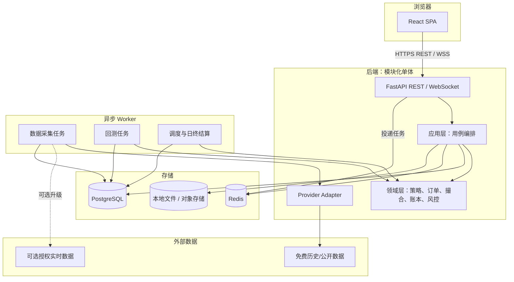
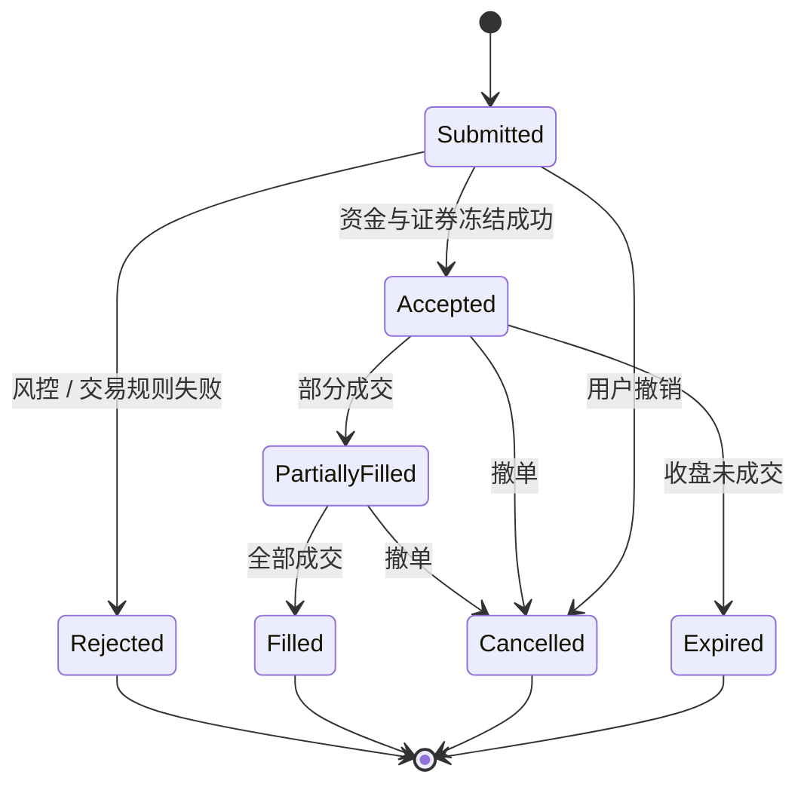
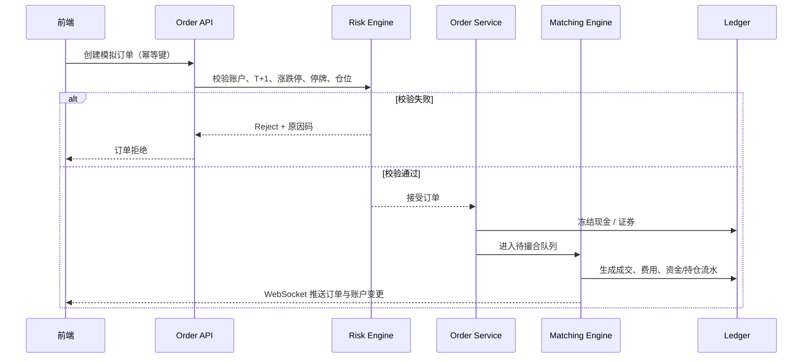
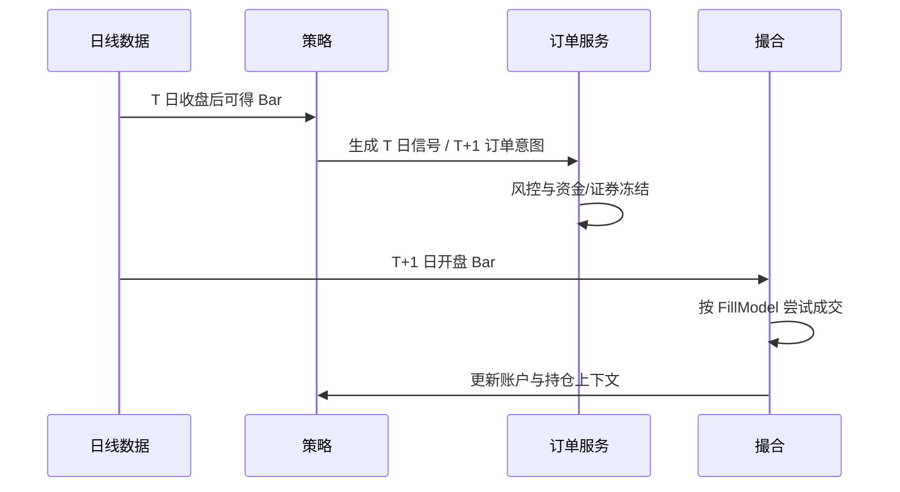

# A 股模拟量化交易系统：方案设计

> 状态：待评审  
> 版本：v0.1  
> 日期：2026-07-26  
> 依据：[需求分析与拆解](../a-share-quant-trading-requirements-v0.1.md)、[项目开发规则](../AGENTS.md)

## 1. 设计目标

本设计用于实现一个前后端分离、以免费数据为默认模式的 A 股模拟量化交易系统。首期目标不是高频或真实交易，而是建立一条可信、可复现、可复盘的闭环：


### 1.1 目标

- 支持沪深 A 股普通股票的历史日线数据、策略回测和模拟账户交易。
- 对 A 股核心交易约束建立统一、可测试的领域模型：交易日、T+1、涨跌停、停复牌、交易单位、费用税费与成交模型。
- 将免费历史/公开数据源封装为可替换 Provider，后续可无侵入接入授权实时行情或券商模拟接口。
- 前端与后端独立部署；前端不直接访问数据源或实现交易规则。
- 每次回测和模拟交易均可追溯策略版本、参数、数据版本、规则配置与订单/成交流水。

### 1.2 非目标

- 不实现真实资金交易、券商自动下单或资金托管。
- 不承诺免费实时行情的完整性、低延迟性或 Level-2 深度。
- MVP 不支持期权、融资融券、期货、可转债、北交所和盘口级高频撮合。
- 不将机器学习训练、新闻/研报 NLP、跨市场套利纳入首期范围。

## 2. 关键设计决策

| 决策 | 选择 | 原因 | 后果 |
|---|---|---|---|
| 系统形态 | 模块化单体 + 异步任务 | 初期交付快、调试容易，仍可通过领域边界拆分。 | 后期高负载时可拆分数据、回测、模拟盘 Worker。 |
| 后端语言 | Python 3.12 + FastAPI | 量化数据与回测生态成熟，适合快速实现并提供 OpenAPI。 | 核心金额与规则必须用强类型/Decimal 和测试弥补动态语言风险。 |
| 前端 | React + TypeScript + Vite | 适合独立 SPA、图表生态成熟。 | 前端只承担展示和调用 API。 |
| 主数据库 | PostgreSQL | 兼顾事务账本、查询、JSON 配置与成熟运维。 | 日线/分钟线可先按分区表管理，规模增长后评估 TimescaleDB。 |
| 缓存与队列 | Redis + Celery | 支持异步采集、回测和日终任务。 | 任务需幂等、可重试、可查询状态。 |
| 数据源 | Provider Adapter | 免费源可能不稳定且字段各异。 | 所有来源需统一为标准模型，且记录数据血缘。 |
| 回测方式 | 事件驱动、日频优先 | 可与模拟盘复用订单、风控、费用和撮合逻辑。 | 首期性能优先保证正确性，不做向量化批量优化。 |
| 成交策略 | 保守可配置 Bar 撮合 | 日线数据无法真实重建盘中撮合。 | 每份报告必须展示成交假设与数据粒度。 |

## 3. 总体架构



### 3.1 仓库结构

```text
frontend/
  src/
    api/                 # 后端 API 客户端与类型
    features/            # 页面领域：行情、策略、回测、模拟盘、风控
    components/          # 可复用展示组件
    routes/              # 路由

backend/
  app/
    api/                 # 路由、Schema、鉴权、中间件
    application/         # 命令/查询用例与 DTO
    domain/              # 纯领域模型与规则
    infrastructure/      # DB、ORM、队列、文件、日志实现
    providers/           # 外部数据源 Adapter
    workers/             # Celery 任务与调度
  tests/
    unit/
    integration/
    fixtures/

docs/
  adr/                   # 架构决策记录
  data-sources.md        # 数据源、许可证、字段和降级策略
  系统设计_v0.1.md
```

## 4. 核心领域设计

领域层不依赖 FastAPI、ORM、SQLAlchemy 或外部 SDK。应用层调用领域对象，基础设施层负责持久化与外部集成。

### 4.1 核心实体

| 聚合 / 实体 | 关键字段 | 责任 |
|---|---|---|
| `Instrument` | `symbol`、`exchange`、`board`、`list_date`、`delist_date`、`status` | 证券主数据与交易规则适用范围。 |
| `MarketBar` | `instrument_id`、`timestamp`、OHLC、`volume`、`amount`、`source`、`published_at` | 规范化的历史/准实时行情。 |
| `Strategy` | `id`、`name`、`version`、`definition`、`parameters` | 策略定义、版本与可执行参数。 |
| `StrategyRun` | `strategy_version`、`data_snapshot_id`、`status`、`started_at` | 一次策略运行的可追溯记录。 |
| `BacktestRun` | `period`、`initial_cash`、`benchmark`、`rule_set_version` | 回测配置、指标与结果索引。 |
| `SimAccount` | `cash`、`frozen_cash`、`status` | 模拟资金账户。 |
| `Position` | `quantity`、`available_quantity`、`frozen_quantity`、`avg_cost` | 持仓与 T+1 可卖数量控制。 |
| `Order` | `side`、`type`、`limit_price`、`quantity`、`status`、`idempotency_key` | 下单意图与订单状态机。 |
| `Fill` | `order_id`、`price`、`quantity`、`fee`、`filled_at` | 模拟成交事实。 |
| `CashLedger` | `account_id`、`amount`、`reason`、`reference_id` | 不可变资金流水。 |
| `RiskRule` / `RiskDecision` | 阈值、作用域、结果、拒绝原因 | 下单前风险判断的可解释记录。 |

### 4.2 订单状态机



约束：

- 所有订单提交必须包含幂等键；同一账户同一幂等键只能创建一张订单。
- 下单前冻结现金或可卖证券；拒单、撤单、过期后释放对应冻结量。
- `Fill` 一经生成不可修改；更正以反向流水或显式更正事件处理。
- 订单与成交金额使用 `Decimal`，禁止用 `float` 进行资金累计。

### 4.3 下单与撮合流程



### 4.4 A 股规则服务

领域层通过以下独立服务实现规则，且以配置版本驱动：

| 服务 | 输入 | 输出 / 责任 |
|---|---|---|
| `TradingCalendarService` | 日期、市场 | 是否交易日、交易阶段、下一个交易日。 |
| `PriceLimitService` | 证券、日期、前收盘价 | 涨跌停上下限及是否适用。 |
| `TradabilityService` | 证券状态、行情状态 | 停牌、退市、涨跌停等可交易性判断。 |
| `LotSizeService` | 证券、买卖方向、数量 | 最小交易单位和零股规则校验。 |
| `TPlusOneService` | 持仓批次、交易日 | 可卖数量。 |
| `FeeService` | 市场、方向、成交金额、账户费率 | 佣金、印花税、过户费和最低佣金。 |
| `FillModel` | 订单、市场 Bar、交易阶段 | 可成交数量、价格、滑点与拒绝原因。 |
| `RiskEngine` | 订单、账户、持仓、规则集 | 通过/拒绝/警告及可解释结果。 |

## 5. 数据设计

### 5.1 数据分层

| 层 | 名称 | 说明 | 保留策略 |
|---|---|---|---|
| Raw | 原始层 | 按 Provider 原样保存响应或文件、拉取时间、校验结果。 | 追加写，不覆盖。 |
| Canonical | 规范层 | 统一证券代码、字段、时区、精度和数据质量状态。 | 可按 `source + observed_at` 版本化。 |
| Derived | 派生层 | 复权价格、技术指标、股票池、因子与信号。 | 可根据原始/规范数据重建。 |
| Trading | 交易层 | 订单、成交、持仓、资金流水、快照和风险事件。 | 不可变流水 + 快照。 |

### 5.2 主要表（第一版）

| 表 | 关键列 | 说明 |
|---|---|---|
| `instruments` | `id`、`symbol`、`exchange`、`board`、`list_date`、`delist_date`、`status` | 证券主数据。 |
| `trading_calendars` | `market`、`trade_date`、`is_open`、`sessions` | 交易日和时段。 |
| `market_bars` | `instrument_id`、`timeframe`、`timestamp`、OHLC、`volume`、`source`、`published_at` | 日线优先；唯一键包含证券、周期、时间、来源版本。 |
| `adjustment_factors` | `instrument_id`、`trade_date`、`factor`、`source` | 复权因子，与原始价格分离。 |
| `corporate_actions` | `instrument_id`、`action_type`、`ex_date`、`announced_at`、`payload` | 分红、送配、拆并股等。 |
| `data_snapshots` | `id`、`as_of`、`scope`、`source_versions`、`checksum` | 回测数据快照与血缘。 |
| `strategies` | `id`、`name`、`language`、`definition`、`created_by` | 策略元信息。 |
| `strategy_versions` | `strategy_id`、`version`、`definition_hash`、`parameters_schema` | 不可变策略版本。 |
| `backtest_runs` | `id`、`strategy_version_id`、`snapshot_id`、`config`、`status`、`metrics` | 回测任务与汇总结果。 |
| `sim_accounts` | `id`、`name`、`cash`、`frozen_cash`、`status` | 模拟账户。 |
| `orders` | `id`、`account_id`、`idempotency_key`、`status`、`payload` | 订单状态和审计入口。 |
| `fills` | `id`、`order_id`、`price`、`quantity`、`fee`、`filled_at` | 成交事实。 |
| `cash_ledgers` | `id`、`account_id`、`amount`、`reason`、`reference_id` | 资金流水。 |
| `position_lots` | `account_id`、`instrument_id`、`trade_date`、`quantity`、`available_quantity` | T+1 批次持仓。 |
| `risk_events` | `id`、`account_id`、`rule_code`、`decision`、`detail` | 风控判定和告警。 |

### 5.3 证券代码与时间标准

- 内部证券代码使用 `exchange:symbol`，例如 `SSE:600000`、`SZSE:000001`。
- 存储时间使用 UTC 时间戳；市场业务日期和会话按 `Asia/Shanghai` 计算并显式记录 `trade_date`。
- 价格、金额、费率和数量采用十进制定点；API 使用字符串表达精确十进制，避免 JSON 浮点误差。
- 行情记录必须至少包含 `source`、`observed_at`、`published_at`、`quality_status` 和 `ingested_at`。

## 6. 免费数据 Provider 设计

### 6.1 统一接口

Provider 不参与业务判断，只负责拉取、规范化和报告数据质量。

```python
class MarketDataProvider(Protocol):
    name: str

    def list_instruments(self, as_of: date) -> list[RawInstrument]: ...
    def fetch_trade_calendar(self, start: date, end: date) -> list[RawCalendarDay]: ...
    def fetch_daily_bars(self, symbols: list[str], start: date, end: date) -> list[RawBar]: ...
    def fetch_corporate_actions(self, start: date, end: date) -> list[RawCorporateAction]: ...
```

适配器输出先写 Raw 层，再由规范化服务生成 Canonical 层。禁止策略、回测或 API 直接调用第三方 SDK。

### 6.2 初始数据策略

| 数据类别 | MVP 默认 | 备用 | 系统行为 |
|---|---|---|---|
| 股票主数据、交易日历、日线 | Tushare Pro 免费权限或其他明确可用免费源 | AkShare / Baostock | Provider 配置化；失败时记录任务失败，不用旧数据伪装成新数据。 |
| 公司行为、停复牌、公告可得时间 | 交易所公开资料 / 免费聚合源 | 手工导入 CSV | 标记来源和可得时间；缺失时告警。 |
| 盘中展示行情 | 可配置公开聚合源 | 手工回放 / 延迟模式 | 页面显示来源、更新时间、延迟；不可用于承诺实时成交。 |

### 6.3 数据质量规则

- 同一证券同一交易日不可出现多条有效日线；冲突记录进入隔离队列。
- `low <= min(open, close) <= max(open, close) <= high`，成交量和成交额不得为负。
- 非交易日出现日线、停牌日出现异常成交量、未来时间戳均应标为异常。
- 采集任务保存成功率、缺失证券数、延迟、版本与异常明细。
- 策略/回测只能引用状态为 `valid` 的规范数据快照。

## 7. 策略与回测设计

### 7.1 策略执行契约

第一版仅支持受控的 Python 策略模板或声明式策略配置，不支持用户上传任意代码直接在服务端执行。

```python
class Strategy(Protocol):
    def initialize(self, context: StrategyContext) -> None: ...
    def on_bar(self, context: StrategyContext, bars: dict[str, MarketBar]) -> list[OrderIntent]: ...
    def on_end_of_day(self, context: StrategyContext) -> list[OrderIntent]: ...
```

策略只能返回 `OrderIntent` 或目标仓位；订单服务负责交易规则、风控和执行。策略上下文仅提供当前时点之前可得的数据，禁止访问系统当前时间或未来数据。

### 7.2 日频回测时序

默认日频模型：在交易日收盘后计算信号，订单在**下一交易日开盘价**尝试成交。此模型避免使用当日收盘价生成信号后又以同一收盘价成交的未来函数。



### 7.3 默认成交模型

| 项目 | 默认规则 | 可配置项 |
|---|---|---|
| 订单类型 | 市价意图映射为下一可交易 Bar 的开盘价模拟成交 | 后续支持限价单。 |
| 滑点 | 买入向上、卖出向下的固定 bp 滑点 | 固定 bp、成交量参与率、价差模型。 |
| 成交量限制 | 单根 Bar 最大成交量参与率限制 | 默认值由配置指定。 |
| 涨跌停 | 若价格触及边界且模型无法确认成交，默认不成交。 | 可配置为排队、部分成交或保守拒绝。 |
| 停牌 | 不成交，订单按有效期继续等待或收盘过期。 | 有效期策略。 |
| 费用 | 佣金、最低佣金、印花税、过户费。 | 规则集版本化。 |

### 7.4 回测输出

- 净值与基准曲线；日收益、累计收益、年化收益、最大回撤、波动率、夏普比率。
- 成交清单、订单拒绝/过期原因、换手率、费用汇总、持仓时间线。
- 策略版本、参数、数据快照、成交模型、费用规则、运行日志与随机种子。
- 数据延迟、复权口径和模拟假设的显著提示。

## 8. 模拟盘设计

### 8.1 模拟盘运行模式

| 模式 | 数据驱动 | 目标 | MVP 状态 |
|---|---|---|---|
| 历史回放 | 历史 Bar 逐步推进 | 验证策略和交易规则 | P0 |
| 收盘后模拟 | 收盘后日线更新，生成次日订单 | 低成本、稳定的日频模拟 | P0 |
| 盘中准实时 | 可用的免费延迟行情 | 模拟 UI、观察订单状态 | P1 / Phase 2 |

三种模式复用相同订单、风险、费用、撮合与账本领域服务；差异仅在 Market Clock 和行情输入。

### 8.2 日终结算

日终任务依次执行：

1. 关闭当日市场时钟，过期无效订单；
2. 释放相关冻结资金或证券；
3. 将当日买入批次转为下一交易日可卖；
4. 处理已确认的公司行为；
5. 计算账户净值、持仓估值、风险指标并写入快照；
6. 推送账户与任务状态，生成审计日志。

## 9. API 与实时通信设计

### 9.1 API 原则

- 统一前缀：`/api/v1`。
- API 仅传输 DTO；不直接泄露 ORM 模型。
- 所有命令接口都要求 `Idempotency-Key`。
- 统一错误格式：`code`、`message`、`trace_id`、`details`。
- 所有数值精度字段以字符串返回，例如 `"price": "10.23"`。

### 9.2 核心接口草案

| 方法 | 路径 | 说明 |
|---|---|---|
| `GET` | `/market/instruments` | 证券检索与状态查询。 |
| `GET` | `/market/bars` | 获取日线/分钟线，返回数据来源与更新时间。 |
| `POST` | `/data/imports` | 创建数据同步任务。 |
| `GET` | `/data/imports/{id}` | 查询采集任务与质量报告。 |
| `GET/POST` | `/strategies` | 策略定义与版本创建。 |
| `POST` | `/backtests` | 创建异步回测任务。 |
| `GET` | `/backtests/{id}` | 获取状态、指标、配置和结果。 |
| `POST` | `/sim/accounts` | 创建模拟账户。 |
| `GET` | `/sim/accounts/{id}` | 账户余额、冻结额、净值与状态。 |
| `POST` | `/sim/accounts/{id}/orders` | 提交模拟订单。 |
| `POST` | `/sim/orders/{id}/cancel` | 撤销可撤订单。 |
| `GET` | `/sim/accounts/{id}/orders` | 订单列表和状态。 |
| `GET` | `/sim/accounts/{id}/positions` | 持仓、可卖数量、成本与估值。 |
| `GET` | `/risk/events` | 风控事件与拒绝原因。 |

WebSocket：`/ws/v1/accounts/{account_id}`。消息类型包括 `order.updated`、`fill.created`、`position.updated`、`account.updated`、`task.updated`、`market.quote`。

## 10. 前端设计

### 10.1 页面信息架构

```text
登录（P1）
├── 总览
│   ├── 数据状态与延迟
│   ├── 模拟账户净值
│   └── 风险告警
├── 市场数据
│   ├── 自选行情
│   └── 数据同步状态
├── 策略
│   ├── 策略列表 / 版本
│   └── 参数配置
├── 回测
│   ├── 创建回测
│   └── 回测报告
├── 模拟盘
│   ├── 下单面板
│   ├── 订单 / 成交
│   └── 持仓 / 资金流水
└── 风控与审计
    ├── 规则配置
    └── 风险事件
```

### 10.2 关键交互要求

- 所有行情卡片显示来源、数据粒度、最后更新时间和延迟状态。
- 下单前展示可用现金、可买数量、可卖数量、预估费用与规则校验结果。
- 回测报告固定展示数据快照、策略版本、时间区间、成交模型和费用模型。
- 请求失败、数据为空、任务排队/运行/失败均有明确状态，不显示误导性的空白图表。
- 模拟盘明显展示“模拟交易，不代表真实成交或投资建议”。

## 11. 安全、审计与可观测性

### 11.1 安全

- MVP 可先采用单用户本地模式；若加入登录，使用密码哈希、短期访问 Token 与刷新机制。
- `.env`、API Key、Cookie、账户信息不得写入仓库、日志或前端包。
- 数据 Provider 的密钥仅在后端 Worker 可读；前端从不接触。
- 模拟模式和未来实盘模式使用不同配置、账户类型、数据库命名空间与权限。

### 11.2 审计

以下事件必须写入审计日志：数据同步、策略版本发布、回测创建/结束、订单创建/拒绝/撤销、成交、结算、风控命中、配置变更。

审计记录至少包括：时间、操作者/系统任务、关联实体 ID、请求 ID、前后状态摘要、规则版本和原因码。

### 11.3 可观测性

| 类别 | 指标 / 日志 |
|---|---|
| 数据 | 拉取成功率、最新数据时间、延迟、缺失数、异常行数、Provider 错误率。 |
| 任务 | 队列长度、运行耗时、重试次数、失败原因、任务状态。 |
| 回测 | 数据快照、处理 Bar 数、订单数、成交数、拒单数、耗时。 |
| 模拟盘 | 订单状态分布、成交延迟、冻结异常、账本平衡校验。 |
| API | 响应时间、错误率、授权失败率、追踪 ID。 |

## 12. 部署设计

### 12.1 本地开发

- `frontend`：Vite 开发服务器。
- `backend-api`：FastAPI。
- `worker`：Celery Worker。
- `scheduler`：Celery Beat 或独立调度进程。
- `postgres`、`redis`：Docker Compose 启动。

### 12.2 第一版部署

推荐单机 Docker Compose：反向代理 + 前端静态文件 + API + Worker + Scheduler + PostgreSQL + Redis。数据文件通过挂载卷持久化，数据库每日备份。

生产化拆分条件：分钟级数据规模明显增长、回测任务影响在线 API、或需要多用户隔离时，优先将 Worker 与数据库迁移到独立资源，而非立即拆分全部微服务。

## 13. 测试策略

| 测试层级 | 范围 | 关键案例 |
|---|---|---|
| 单元测试 | 领域规则、费用、订单状态机、成交模型 | T+1、涨跌停、停牌、最小交易单位、最低佣金、幂等下单。 |
| 集成测试 | API + DB + 队列 + Provider 规范化 | 采集落库、回测任务、下单到流水、任务重试。 |
| 契约测试 | Provider 与前端 API | 字段映射、错误码、精度和版本兼容性。 |
| 端到端测试 | 核心用户路径 | 创建策略、运行回测、创建账户、下单、查看成交与净值。 |
| 回归 Fixture | 固定市场片段 | 除权除息、停牌、涨跌停、退市、重复请求。 |

必须满足的账本不变量：

- 可用现金 + 冻结现金 + 已结算支出/收入与资金流水可对账。
- 持仓数量 = 可用数量 + 冻结数量。
- 每个成交必须对应有效订单与资金/证券流水。
- 同一幂等键不会产生重复订单或重复扣款。

## 14. 实施顺序

### Milestone 0：工程骨架与规则验证

- 初始化前后端工程、Docker Compose、代码质量工具和 CI。
- 建立 PostgreSQL schema、迁移机制、基础审计和 `.env.example`。
- 实现证券、交易日历、日线数据规范模型与一个 Provider PoC。
- 实现并测试 T+1、交易单位、费用、停牌、涨跌停规则服务。

**验收：**可导入固定历史 Fixture；核心规则测试全部通过。

### Milestone 1：日频回测 MVP

- 实现策略模板、数据快照、日频市场时钟、订单意图和保守 Bar 撮合。
- 实现异步回测、绩效指标、结果持久化与回测 API。
- 前端实现策略列表、创建回测和报告页面。

**验收：**至少两个示例策略能够可复现地运行，报告能完整说明数据/规则假设。

### Milestone 2：模拟账户与模拟盘

- 实现账户、订单、成交、持仓批次、资金流水、日终结算和风险事件。
- 实现下单/撤单 API、WebSocket 推送和模拟盘前端。
- 接入可配置的准实时 Provider（可用时）或历史回放时钟。

**验收：**连续运行多个交易日后，订单、持仓、现金和净值可审计对账。

### Milestone 3：增强与运维

- 分钟级行情、批量参数实验、策略/账户权限、告警、备份、监控面板。
- 建立商业数据 Provider 的可选接口，不改变领域模型。

## 15. 评审待确认项

以下决策会直接影响第一阶段实现范围，请确认后再开始编码：

1. 是否确认技术栈：**React + TypeScript + FastAPI + PostgreSQL + Redis + Celery**？
2. 是否确认 MVP 仅支持**沪深 A 股普通股票 + 日频行情 + 下一交易日开盘模拟成交**？
3. 是否确认首个可运行版本采用**单用户、本地 Docker Compose 部署**，多用户登录延后至 P1？
4. 是否确认免费数据仅保证“历史与收盘后更新”，盘中准实时行情作为 Phase 2 可选能力？
5. 是否确认默认成交模型为“保守不成交”：停牌、无法判断涨跌停成交、超过成交量参与率的部分均不默认成交？
6. 是否确认策略首期仅支持受控模板/声明式配置，不开放用户上传任意 Python 代码执行？

## 16. 评审结论模板

评审后请按以下形式确认或修改：

```text
技术栈：确认 / 修改为 …
MVP 标的与频率：确认 / 修改为 …
部署形态：确认 / 修改为 …
实时行情边界：确认 / 修改为 …
默认成交模型：确认 / 修改为 …
策略执行方式：确认 / 修改为 …
其他调整：…
```
